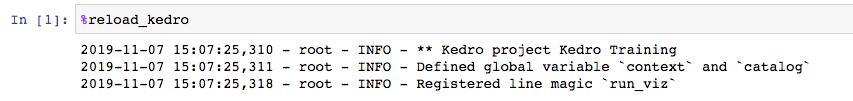
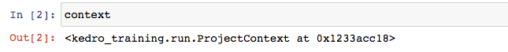
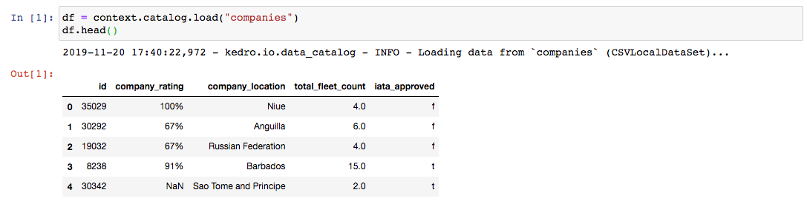
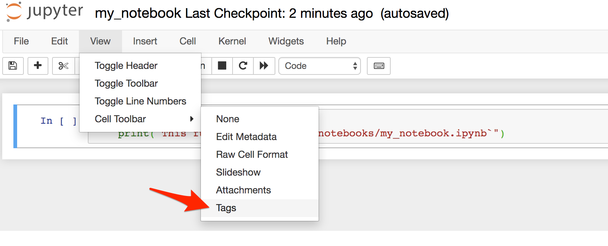
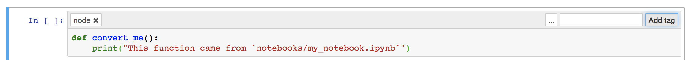

# Jupyter Notebook Workflow

In order to experiment with the code interactively, you may want to use a Python kernel inside a Jupyter Notebook. To start, run this in your terminal from the root of your Kedro project:

```bash
kedro jupyter notebook
```

This will start a Jupyter server and navigate you to `http://127.0.0.1:8888/tree` in your default browser.

> Note: If you want Jupyter to listen to a different port number, then run `kedro jupyter notebook --port <post>`

## Startup script

Every time you start/restart a Jupyter or IPython session using Kedro command, a startup script in `.ipython/profile_default/startup/00-kedro-init.py` is being executed. It adds the following variables in scope:

* `context` (`KedroContext`) - Kedro project context which holds the configuration
* `catalog` (`DataCatalog`) - Data catalog instance which contains all defined datasets; this is a shortcut for `context.catalog`
* `startup_error` (`Exception`) - An error that was raised during the execution of the startup script or `None` if no errors occurred

To reload these at any point use the line magic `%reload_kedro`. This magic can also be used to see the error message if any of the variables above are undefined.



## What if I cannot run `kedro jupyter notebook`?

In certain cases, you may not be able to run `kedro jupyter notebook` and have to work in a standard Jupyter session. An example of this may be because you don't have a CLI access to the machine where the Jupyter server is running. In that case, you can create a `context` variable yourself by running the following block of code at the top of your notebook:

```python
from pathlib import Path
from kedro.context import load_context

current_dir = Path.cwd()  # this points to 'notebooks/' folder
proj_path = current_dir.parent  # point back to the root of the project
context = load_context(proj_path)
```

## Using `context` variable



As mentioned earlier in the project overview section, `KedroContext` represents the main application entry point, so having `context` variable available in Jupyter Notebook gives a lot of flexibility in interaction with your project components.

### Loading a dataset

You can load a dataset defined in your `conf/base/catalog.yml`, by simply executing the following:

```python
df = context.catalog.load("companies")
df.head()
```



### Saving a data

Saving operation in the example below is analogous to the load.

Let's put the following dataset entry in `conf/base/catalog.yml`:

```yaml
my_dataset:
  type: JSONLocalDataSet
  filepath: data/01_raw/my_dataset.json
```

Next, you need to reload Kedro variables by calling `%reload_kedro` line magic in your Jupyter Notebook.

Finally, you can save the data by executing the following command:

```python
my_dict = {"key1": "some_value", "key2": None}
context.catalog.save("my_dataset", my_dict)
```

### Using parameters

`context` object also exposes `params` property, which allows you to easily access all project parameters:

```python
parameters = context.params  # type: Dict
parameters["test_size"]  # returns the value of 'test_size' key from 'parameters.yml'
```

> Note: You need to reload Kedro variables by calling `%reload_kedro` and re-run the code snippet from above if you change the contents of `parameters.yml`.

### Running the pipeline

As already mentioned, `KedroContext` represents the main application entry point, which in practice means that you can use `context` object to run your Kedro project pipelines.

If you wish to run the whole 'master' pipeline within a notebook cell, you can do it by just calling

```python
context.run()
```

which will run all the nodes from your default project pipeline in a sequential manner.

If you, however, want to parameterize the run, you can also specify the following optional arguments for `context.run()`:

|  Argument name  |  Accepted types  | Description                                                                                                                                                                                                                                    |
| :-------------: | :--------------: | :--------------------------------------------------------------------------------------------------------------------------------------------------------------------------------------------------------------------------------------------- |
|     `tags`      | `Iterable[str]`  | Construct the pipeline using only nodes which have this tag attached. A node is included in the resulting pipeline if it contains _any_ of those tags                                                                                          |
|    `runner`     | `AbstractRunner` | An instance of Kedro [AbstractRunner](https://kedro.readthedocs.io/en/stable/kedro.runner.AbstractRunner.html); for example, can be an instance of a [ParallelRunner](https://kedro.readthedocs.io/en/stable/kedro.runner.ParallelRunner.html) |
|  `node_names`   | `Iterable[str]`  | Run only nodes with specified names                                                                                                                                                                                                            |
|  `from_nodes`   | `Iterable[str]`  | A list of node names which should be used as a starting point                                                                                                                                                                                  |
|   `to_nodes`    | `Iterable[str]`  | A list of node names which should be used as an end point                                                                                                                                                                                      |
|  `from_inputs`  | `Iterable[str]`  | A list of dataset names which should be used as a starting point                                                                                                                                                                               |
| `load_versions` | `Dict[str, str]` | A mapping of a dataset name to a specific dataset version (timestamp) for loading - this applies to the versioned datasets only                                                                                                                |
| `pipeline_name` |      `str`       | Name of the modular pipeline to run - must be one of those returned by `create_pipelines` function from `src/<package_name>/pipeline.py`                                                                                                       |

This list of options is fully compatible with the list of CLI options for `kedro run` command. In fact, `kedro run` is calling `context.run()` behind the scenes.

### Converting functions from Jupyter Notebooks into Kedro nodes

Another useful built-in feature in Kedro Jupyter workflow is the ability to convert multiple functions defined in the Jupyter Notebook(s) into Kedro nodes using a single CLI command.

Here is how it works:

* start a Jupyter server, if you haven't done so already, by running `kedro jupyter notebook`
* create a new notebook and paste the following code into the first cell:

```python
def convert_me():
    print("This function came from `notebooks/my_notebook.ipynb`")
```

* enable tags toolbar: `View` menu -> `Cell Toolbar` -> `Tags`

* add the `node` tag to the cell containing your function

> Tip: The notebook can contain multiple functions tagged as `node`, each of them will be exported into the resulting Python file

* save your Jupyter Notebook to `notebooks/my_notebook.ipynb`
* run from your terminal: `kedro jupyter convert notebooks/my_notebook.ipynb` - this will create a Python file `src/<package_name>/nodes/my_notebook.py` containing `convert_me` function definition
> Tip: You can also convert all your notebooks at once by calling `kedro jupyter convert --all`
* now `convert_me` function can be used in your Kedro pipelines

### Next section
[Go to the next section](./07_pipelines.md)
