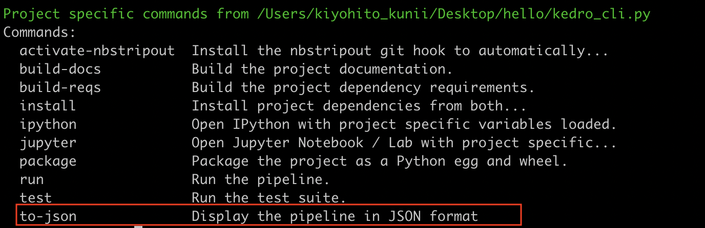

# Customise Kedro CLI

While Kedro provides a number of pre-defined CLI options off the shelf in `kedro_cli.py`,
you can easily add a custom option in your project by adding a new `@click.option` decorator to a function in `kedro_cli.py`. You can learn more about the click options in [their documentation](https://click.palletsprojects.com/en/7.x/options/).

## Example of adding a custom CLI command

If you want to add a new Kedro command, simply add a `@cli.command()` and a corresponding function. In `kedro_cli.py`, add the new function as follows:

```python
from kedro.cli import get_project_context

@cli.command()
def to_json():
    """ Display the pipeline in JSON format """
    context = get_project_context()
    print(context.pipeline.to_json())
```

After the modification, running `kedro` in your terminal will show the new command.




## Example of a custom CLI option

`kedro run` already supports a number of options such as `--tag` or `--load-version`, but as an illustration we will add a new option that allows you to dynamically pass extra parameters to your run.

First, let's add another `@click.option` decorator and a helper function. Update `kedro_tutorial/kedro_cli.py` as follows:

```python
# ...

PARAMETER_HELP = """Pass a particular parameter key-value pair."""


def _reformat_parameter_input(ctx, param, value) -> Dict[str, str]:
    """Reformat data structure from tuple to dictionary for `parameter`.
        E.g ('param_key1:param_value1', 'param_key2:param_value2') ->
            {"param_key1": "param_value1", "param_key2": "param_value2"}.
    """
    input_separator = ":"
    parameter_dict = {}

    for parameter in value:
        key, value = parameter.split(input_separator, 1)
        parameter_dict[key] = value

    return parameter_dict

# ...
@click.option(
    "--parameter",
    type=str,
    multiple=True,
    help=PARAMETER_HELP,
    callback=_reformat_parameter_input,
)
def run(
    tag,
    env,
    parallel,
    runner,
    node_names,
    to_nodes,
    from_nodes,
    from_inputs,
    load_version,
    pipeline,
    parameter, # additional argument
):
    """Run the pipeline."""
    if parallel and runner:
        raise KedroCliError(
            "Both --parallel and --runner options cannot be used together. "
            "Please use either --parallel or --runner."
        )
    if parallel:
        runner = "ParallelRunner"
    runner_class = load_obj(runner, "kedro.runner") if runner else SequentialRunner

    context = load_context(Path.cwd(), env=env, extra_params=parameter) # Update
    context.run(
        tags=tag,
        runner=runner_class(),
        node_names=node_names,
        from_nodes=from_nodes,
        to_nodes=to_nodes,
        from_inputs=from_inputs,
        load_versions=load_version,
        pipeline_name=pipeline,
    )
```

The passed parameter argument then needs to be passed to `params` property in `ProjectContext(KedroContext)` in `src/kedro_training/run.py`. Update the existing `ProjectContext(KedroContext)` class as follows:

```python
from typing import Iterable, Type, Dict, Any # Update import
# ...

class ProjectContext(KedroContext):
    """Users can override the remaining methods from the parent class here, or create new ones
    (e.g. as required by plugins)

    """
    # ...

    def __init__(self, project_path, env=None, extra_params=None): # Add extra_params argument
        self.extra_params = extra_params  # Additional attribute
        super().__init__(project_path, env=env)

    def _get_pipelines(self) -> Dict[str, Pipeline]:
        return create_pipelines()

    @property
    def params(self) -> Dict[str, Any]:
        """Read-only property referring to Kedro's parameters for this context.

        Returns:
            Parameters defined in `parameters.yml`.
        """
        params = super().params  # Read 'base' parameters
        params.update(self.extra_params or {})  # Add extra parameters from CLI
        return params
```
After these modifications, you should be able to run the pipeline with a new parameter flag as follows:
```shell
kedro run --parameter="param_key:param_value"
```
This way, `"params:param_key"` will become available in a node input in your pipeline.

### Next section
[Go to the next section](./15_plugins.md)
