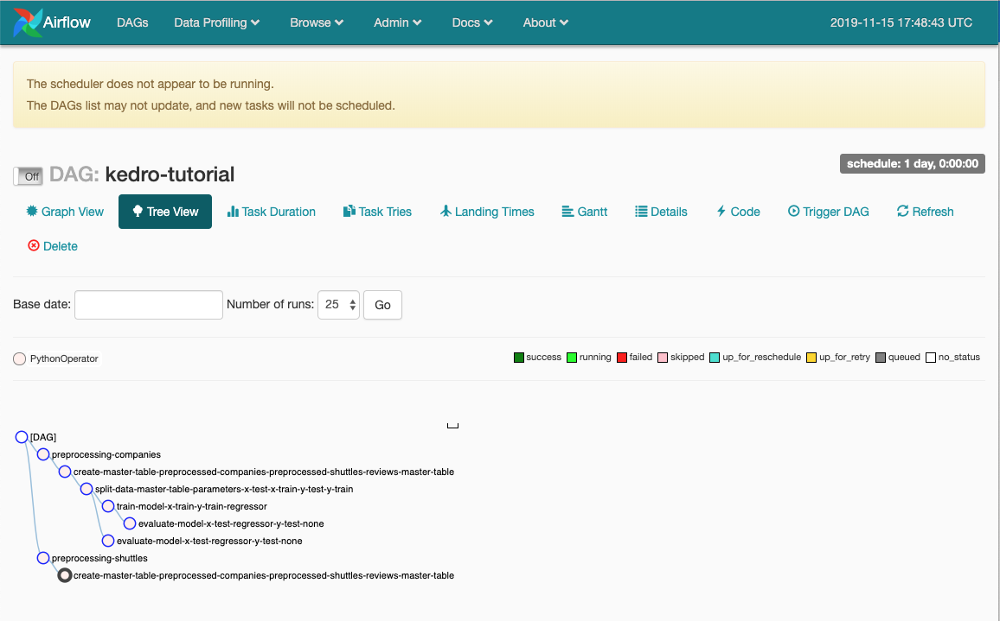

# Kedro plugins

The functionality of Kedro can be extended using its `plugin` framework, which helps creating new features for Kedro and allows you to inject additional commands into the CLI. Plugins are developed as separate Python packages that exist outside of any Kedro project.

## How to create a plugin

1. Create a separate repository using our naming convention for plugins: `kedro-<plugin-name>`
2. Create `click` group(s) for `global` and / or `project` commands

## Example of a simple plugin

A simple plugin that prints the pipeline as JSON might look like:

`kedrojson/plugin.py`:

```python
import click
from kedro.cli import get_project_context


@click.group(name="JSON")
def commands():
    """ Kedro plugin for printing the pipeline in JSON format """
    pass


@commands.command(name="to-json")
def to_json():
    """ Display the pipeline in JSON format """
    context = get_project_context()
    print(context.pipeline.to_json())
```

And have the following entry_points config in `setup.py`:

```python
entry_points={
    'kedro.project_commands': ['kedrojson = kedrojson.plugin:commands'],
}
```

To install the plugin, run the following from your terminal:

```bash
cd <path-to-kedrojson-dir>  # navigate to kedrojson folder
pip install .  # install the Python package from the current working directory
```

Once the plugin is installed, you can run it as follows:

```bash
cd <path-to-project-root>
kedro to-json
```

# Kedro-Docker

Configuring a Docker container environment may become complex and tedious. [Kedro-Docker](https://github.com/quantumblacklabs/kedro-docker) significantly simplifies this process and reduces it to 2 steps:

## How do I install Kedro-Docker?

You can install Kedro-Docker as a regular Python package:

```bash
pip install kedro-docker
```

## Prerequisites

Kedro-Docker assumes that [Docker daemon](https://docs.docker.com/engine/docker-overview/) is up and running in your system.

## Build a Docker image

In order to build a Docker image for your project, navigate to the project's root directory and run the following from the command line:

```bash
kedro docker build
```

Behind the scenes Kedro-Docker does the following:

1. Creates a template `Dockerfile` and `.dockerignore` in the project root directory if those files don't already exist
2. Builds the project image using the Dockerfile

`kedro docker build` accepts any valid `docker build` CLI command options specified inside `--docker-args` option. For example, `kedro docker build --docker-args="--no-cache"` instructs Docker not to use cache when building the image. You can find the list of available options [here](https://docs.docker.com/engine/reference/commandline/build/).

## Run your project in a Docker container

Once the project image has been built, you can run the project using a Docker environment:

```bash
kedro docker run
```

The command above will:

1. Locate the image built in the previous section
2. Copy the whole project directory into the `/home/kedro` container path
3. Execute the `kedro run` command in a new container

> Note: The `kedro docker run` command adds `--rm` flag to the underlying `docker run` call, therefore the container will be automatically removed when the main process exits. Please make sure that you persist all necessary data outside the container at runtime to avoid data loss.

Similar to `kedro docker build` command above, when calling `kedro docker run` you can pass `docker run`-specific options by providing `--docker-args` option. For example, `kedro docker run --docker-args="--env KEY=MYVALUE"` instructs Docker to set environment variable `KEY` to `MYVALUE` in the container. The full list of available options can be found [here](https://docs.docker.com/engine/reference/commandline/run/).

## Running custom project commands inside a Docker container

You can also run an arbitrary command inside Docker container by executing `kedro docker cmd <CMD>`, where `<CMD>` corresponds to the command that you want to execute. If `<CMD>` is not specified, this will execute `kedro run` inside the container.

For example:

1. `kedro docker cmd kedro test` will run `kedro test` inside the container
2. `kedro docker cmd` will execute `kedro run` inside the container
3. `kedro docker cmd --docker-args="-it" /bin/bash` will create an interactive Bash shell in the container (and allocate a pseudo-TTY connected to the container’s standard input).

# Kedro-Airflow

Kedro is not a workflow scheduler. Kedro makes it easy to prototype your data pipeline, while Airflow is a complementary framework that is great at managing deployment, scheduling, monitoring and alerting. A Kedro pipeline is like a machine that builds a car part. While Airflow tells the different Kedro machines to switch on or off to work together to produce a car. We have built a [Kedro-Airflow](https://github.com/quantumblacklabs/kedro-airflow/) plugin, providing faster prototyping time and reducing the barriers to entry associated with moving pipelines to Airflow.

[Apache Airflow](https://github.com/apache/airflow) is a tool for orchestrating complex workflows and data processing pipelines. The Kedro-Airflow plugin can be used for:
- Rapid pipeline creation in the prototyping phase. You can write Python functions in Kedro without worrying about schedulers, daemons, services or having to recreate the Airflow DAG file.
- Automatic dependency resolution in Kedro. This allows you to bypass Airflow's need to specify the order of your tasks.
- Distributing Kedro tasks across many workers. You can also enable monitoring and scheduling of the tasks' runtime.


`kedro-airflow` is a Python plugin. To install it:

```bash
pip install kedro-airflow
```

The Kedro-Airflow plugin adds a `kedro airflow create` CLI command that generates an Airflow DAG file in the `airflow_dags` folder of your project. At runtime, this file translates your Kedro pipeline into Airflow Python operators. This DAG object can be modified according to your needs and you can then deploy your project to Airflow by running `kedro airflow deploy`.

## Prerequisites

The following conditions must be true for Airflow to run your pipeline:
* Your project directory must be available to the Airflow runners in the directory listed at the top of the DAG file.
* Your source code must be on the Python path (by default the DAG file takes care of this).
* All datasets must be explicitly listed in `catalog.yml` and reachable for the Airflow workers. Kedro-Airflow does not support the `MemoryDataSet` or datasets that require Spark.
* All local paths in configuration files (notably in `catalog.yml` and `logging.yml`) should be absolute paths and not relative paths.

## Process

1. Run `kedro airflow create` to generate a DAG file for your project.
2. If needed, customize the DAG file as described [below](https://github.com/quantumblacklabs/kedro-airflow/blob/master/README.md#customization).
3. Run `kedro airflow deploy` which will copy the DAG file from the `airflow_dags` folder in your Kedro project into the `dags` folder in the Airflow home directory.

> *Note:* The generated DAG file will be placed in `$AIRFLOW_HOME/dags/` when `kedro airflow deploy` is run, where `AIRFLOW_HOME` is an environment variable. If the environment variable is not defined, Kedro-Airflow will create `~/airflow` and `~/airflow/dags` (if required) and copy the DAG file into it.

If you need more customisation for Airflow, you can find more information in the [README](https://github.com/quantumblacklabs/kedro-airflow).

Once `dags` folder is created, you can perform airflow commands. For example, you could run `airflow initdb` to initialise the Airflow SQLite database `airflow.db` under `$AIRFLOW_HOME/dags/`, or `airflow webserver` to start Flask server for Airflow UI as follows:



You can find more details about Airflow command in their [documentation](https://airflow.apache.org/howto/index.html).
